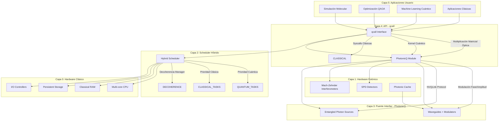
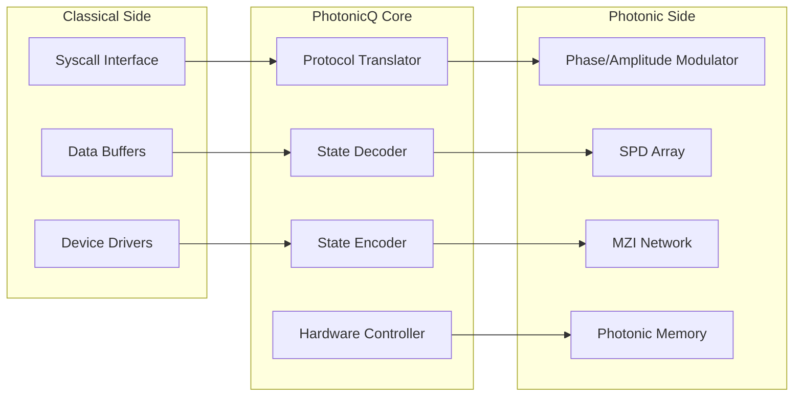
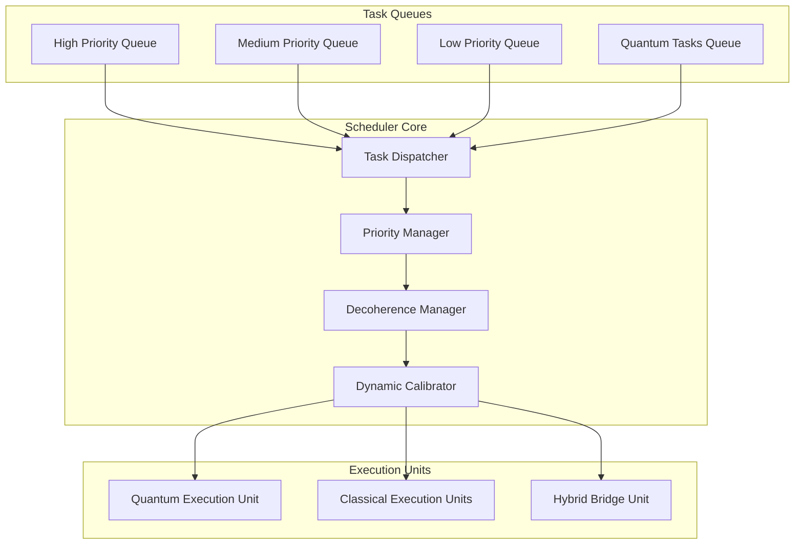
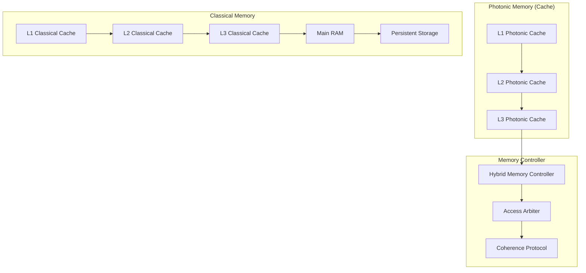
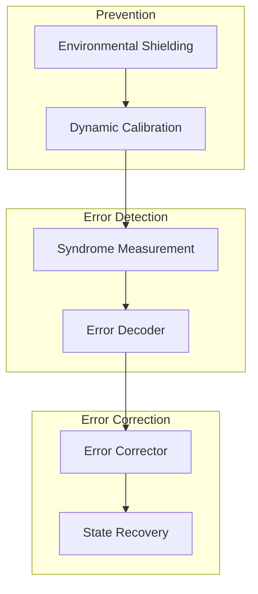

# 🚀 Kernel OS Híbrido Cuántico-Fotónico

## Arquitectura del Futuro: Uniendo Qubits Fotónicos con Núcleo Clásico

**Autor:** Giovanny Anthony Corpus Bernal  
**Fecha:** Marzo 2026  
**Versión:** 1.0.0  
**Estado:** Diseño de Arquitectura

---

## 🎯 Visión General

Este kernel representa la próxima evolución en computación: un sistema operativo que une **qubits fotónicos** (basados en waveguides, detectores homodyne, interferómetros Mach-Zehnder y fuentes de fotones entrelazados) con un **núcleo clásico** de scheduling, memoria y I/O.

### Principios Fundamentales

1. **Baja Latencia**: < 1ms para operaciones cuánticas via NVQLink-like
2. **Bajo Consumo**: Fotónica integrada en silicio (PICs CMOS)
3. **Escalabilidad**: Compatible con chips híbridos GaAs + LiNbO3
4. **Corrección de Errores**: Feedback óptico en tiempo real
5. **Coherencia Dinámica**: Recalibración automática de waveguides

---

## 🏗️ Arquitectura de 5 Capas



---

## 🔬 Capa 1: Hardware Fotónico

### 1.1 Waveguides con Moduladores

```
┌─────────────────────────────────────────────────────────────┐
│                    WAVEGUIDE ARRAY                           │
│  ┌─────────┐    ┌─────────┐    ┌─────────┐    ┌─────────┐  │
│  │ Input   │───▶│ Phase   │───▶│ Amplitude│───▶│ Output  │  │
│  │ Coupler │    │ Modulator│    │ Modulator│    │ Coupler │  │
│  └─────────┘    └─────────┘    └─────────┘    └─────────┘  │
│       │              │              │              │        │
│       ▼              ▼              ▼              ▼        │
│  [SiN Waveguide] [LiNbO3] [Graphene] [SiN Waveguide]      │
│                                                              │
│  Pérdida: < 0.1 dB/cm  │  Ancho de banda: > 100 GHz       │
└─────────────────────────────────────────────────────────────┘
```

**Especificaciones:**
- **Material**: Silicio nitruro (SiN) sobre óxido
- **Pérdida de inserción**: < 0.1 dB/cm
- **Moduladores**: LiNbO3 para fase, Grafeno para amplitud
- **Velocidad de modulación**: > 100 GHz
- **Temperatura operación**: 4K - 300K (configurable)

### 1.2 Detectores SPD (Single-Photon Detectors)

```
┌─────────────────────────────────────────────────────────────┐
│                SPD DETECTOR ARRAY                            │
│                                                              │
│  ┌──────────┐  ┌──────────┐  ┌──────────┐  ┌──────────┐   │
│  │ NbN SSPD │  │ NbN SSPD │  │ NbN SSPD │  │ NbN SSPD │   │
│  │  Ch 0    │  │  Ch 1    │  │  Ch 2    │  │  Ch 3    │   │
│  └────┬─────┘  └────┬─────┘  └────┬─────┘  └────┬─────┘   │
│       │             │             │             │           │
│       ▼             ▼             ▼             ▼           │
│  [TIA + Discriminator + TDC]                                │
│                                                              │
│  Eficiencia: > 95%  │  Dark count: < 1 Hz  │  Jitter: < 50ps│
└─────────────────────────────────────────────────────────────┘
```

**Especificaciones:**
- **Tipo**: NbN SSPD (Superconducting Nanowire)
- **Eficiencia cuántica**: > 95% @ 1550 nm
- **Dark count rate**: < 1 Hz
- **Jitter temporal**: < 50 ps
- **Velocidad de conteo**: > 1 GHz
- **Temperatura operación**: 2-4 K (cryo-cooler integrado)

### 1.3 Interferómetros Mach-Zehnder

```
┌─────────────────────────────────────────────────────────────┐
│           MACH-ZEHNDER INTERFEROMETER                        │
│                                                              │
│  Input ──┬──────────────────────────────────┬── Output 0    │
│          │                                  │                │
│          │    ┌─────────────────────┐       │                │
│          │    │   Phase Shifter     │       │                │
│          │    │   (Δφ = 0 to 2π)   │       │                │
│          │    └─────────────────────┘       │                │
│          │                                  │                │
│          └──────────────────────────────────┴── Output 1    │
│                                                              │
│  Visibilidad: > 99%  │  Pérdida: < 0.5 dB                  │
└─────────────────────────────────────────────────────────────┘
```

**Aplicaciones:**
- **Puertas cuánticas**: Hadamard, Phase, CNOT
- **Entrelazamiento**: Generación de estados Bell
- **Interferometría**: Mediciones de fase ultra-precisas
- **Routing**: Conmutación óptica de qubits

### 1.4 Fuentes de Fotones Entrelazados

```
┌─────────────────────────────────────────────────────────────┐
│         ENTANGLED PHOTON SOURCE (Type-II SPDC)              │
│                                                              │
│  Pump Laser ──▶ [PPLN Waveguide] ──▶ Signal + Idler        │
│  (775 nm)        (Periodically Poled)   (1550 nm each)     │
│                      │                                      │
│                      ▼                                      │
│              [Hong-Ou-Mandel Interferometer]                │
│                      │                                      │
│                      ▼                                      │
│              [Bell State Analyzer]                           │
│                                                              │
│  Tasa generación: > 10⁶ pares/s  │  Fidelidad: > 99%      │
└─────────────────────────────────────────────────────────────┘
```

**Especificaciones:**
- **Tipo**: SPDC Type-II en PPLN waveguide
- **Tasa de generación**: > 10⁶ pares/segundo
- **Fidelidad Bell**: > 99%
- **Ancho de banda espectral**: < 1 nm
- **Polarización**: Ortogonal (H/V)

---

## 🔌 Capa 2: Puente Interfaz - PhotonicQ

### 2.1 Arquitectura del Módulo PhotonicQ



### 2.2 Protocolo NVQLink-like

```
┌─────────────────────────────────────────────────────────────┐
│                    NVQLINK PROTOCOL                          │
│                                                              │
│  ┌─────────────────────────────────────────────────────┐   │
│  │ Layer 4: Application                                 │   │
│  │   - qcall API                                        │   │
│  │   - Quantum operations                               │   │
│  └─────────────────────────────────────────────────────┘   │
│                          │                                   │
│  ┌─────────────────────────────────────────────────────┐   │
│  │ Layer 3: Quantum Virtual Machine                     │   │
│  │   - State management                                 │   │
│  │   - Error correction                                 │   │
│  └─────────────────────────────────────────────────────┘   │
│                          │                                   │
│  ┌─────────────────────────────────────────────────────┐   │
│  │ Layer 2: Photonic Transport                          │   │
│  │   - Pulse encoding                                   │   │
│  │   - Timing synchronization                           │   │
│  └─────────────────────────────────────────────────────┘   │
│                          │                                   │
│  ┌─────────────────────────────────────────────────────┐   │
│  │ Layer 1: Physical Photonic                           │   │
│  │   - Waveguide control                                │   │
│  │   - Detector readout                                 │   │
│  └─────────────────────────────────────────────────────┘   │
│                                                              │
│  Latencia: < 1 ms  │  Throughput: > 10 Gbps                │
└─────────────────────────────────────────────────────────────┘
```

### 2.3 Traducción Syscall → Pulso Óptico

```rust
// Ejemplo de traducción syscall a pulso óptico
pub fn syscall_to_photonic(syscall: SyscallType) -> PhotonicPulse {
    match syscall {
        SyscallType::MatrixMultiply { a, b } => {
            // Multiplicación matricial óptica usando MZI mesh
            PhotonicPulse {
                wavelength: 1550.0, // nm
                phase_pattern: encode_matrix(a),
                amplitude_pattern: encode_matrix(b),
                duration: 100, // ps
                power: 1.0, // mW
            }
        }
        SyscallType::QuantumKernel { state, operation } => {
            // Kernel cuántico en hardware fotónico
            PhotonicPulse {
                wavelength: 1550.0,
                phase_pattern: encode_quantum_state(state),
                amplitude_pattern: encode_operation(operation),
                duration: 50, // ps
                power: 0.5, // mW
            }
        }
        _ => classical_to_photonic(syscall)
    }
}
```

---

## ⚡ Capa 3: Scheduler Híbrido

### 3.1 Arquitectura del Scheduler



### 3.2 Priorización de Tareas

```
┌─────────────────────────────────────────────────────────────┐
│              TASK PRIORITY MATRIX                            │
│                                                              │
│  ┌─────────────────┬─────────────────┬─────────────────┐   │
│  │   PRIORITY 0    │   PRIORITY 1    │   PRIORITY 2    │   │
│  │   (Highest)     │   (High)        │   (Medium)      │   │
│  ├─────────────────┼─────────────────┼─────────────────┤   │
│  │ Quantum Error   │ VQE/QAOA       │ Molecular       │   │
│  │ Correction      │ Optimization   │ Simulation      │   │
│  │                 │                 │                 │   │
│  │ Decoherence     │ Quantum ML     │ Optimization    │   │
│  │ Recovery        │                 │ Problems        │   │
│  ├─────────────────┼─────────────────┼─────────────────┤   │
│  │   PRIORITY 3    │   PRIORITY 4    │   PRIORITY 5    │   │
│  │   (Low)         │   (Lower)       │   (Lowest)      │   │
│  ├─────────────────┼─────────────────┼─────────────────┤   │
│  │ Classical I/O   │ Background     │ Batch           │   │
│  │ Operations      │ Tasks          │ Processing      │   │
│  │                 │                 │                 │   │
│  │ Memory          │ Logging        │ Maintenance     │   │
│  │ Management      │                 │                 │   │
│  └─────────────────┴─────────────────┴─────────────────┘   │
│                                                              │
│  Quantum tasks: 10x priority boost vs classical             │
└─────────────────────────────────────────────────────────────┘
```

### 3.3 Gestión de Decoherencia

```rust
pub struct DecoherenceManager {
    coherence_time: Duration,
    last_calibration: Instant,
    waveguide_states: Vec<WaveguideState>,
}

impl DecoherenceManager {
    pub fn monitor_and_recalibrate(&mut self) {
        for (i, waveguide) in self.waveguide_states.iter_mut().enumerate() {
            let coherence = waveguide.measure_coherence();
            
            if coherence < COHERENCE_THRESHOLD {
                // Recalibración dinámica
                self.recalibrate_waveguide(i);
                waveguide.coherence = 1.0;
                waveguide.last_calibration = Instant::now();
            }
        }
    }
    
    fn recalibrate_waveguide(&self, index: usize) {
        // Ajuste de fase compensando deriva térmica
        let thermal_drift = self.measure_thermal_drift(index);
        let phase_correction = -thermal_drift;
        
        self.apply_phase_correction(index, phase_correction);
    }
}
```

---

## 💾 Capa 4: Sistema de Memoria

### 4.1 Jerarquía de Memoria Híbrida



### 4.2 Memoria Fotónica como Cache Ultra-Rápido

```
┌─────────────────────────────────────────────────────────────┐
│              PHOTONIC CACHE ARCHITECTURE                     │
│                                                              │
│  ┌─────────────────────────────────────────────────────┐   │
│  │ L1 Photonic Cache (On-chip)                          │   │
│  │   - Tamaño: 256 KB                                   │   │
│  │   - Latencia: < 100 ps                               │   │
│  │   - Tecnología: Ring resonator arrays                │   │
│  │   - Pérdida: < 0.01 dB                               │   │
│  └─────────────────────────────────────────────────────┘   │
│                          │                                   │
│  ┌─────────────────────────────────────────────────────┐   │
│  │ L2 Photonic Cache (Near-chip)                        │   │
│  │   - Tamaño: 2 MB                                     │   │
│  │   - Latencia: < 500 ps                               │   │
│  │   - Tecnología: Waveguide delay lines                │   │
│  │   - Pérdida: < 0.1 dB                                │   │
│  └─────────────────────────────────────────────────────┘   │
│                          │                                   │
│  ┌─────────────────────────────────────────────────────┐   │
│  │ L3 Photonic Cache (Off-chip)                         │   │
│  │   - Tamaño: 16 MB                                    │   │
│  │   - Latencia: < 2 ns                                 │   │
│  │   - Tecnología: Fiber delay lines                    │   │
│  │   - Pérdida: < 1 dB                                  │   │
│  └─────────────────────────────────────────────────────┘   │
│                                                              │
│  Ventaja: 1000x más rápido que DRAM para quantum states    │
└─────────────────────────────────────────────────────────────┘
```

### 4.3 RAM Clásica para Persistencia

```
┌─────────────────────────────────────────────────────────────┐
│              CLASSICAL MEMORY HIERARCHY                      │
│                                                              │
│  ┌─────────────────────────────────────────────────────┐   │
│  │ Main RAM (DDR5/HBM3)                                 │   │
│  │   - Tamaño: 256 GB - 2 TB                            │   │
│  │   - Latencia: < 50 ns                                │   │
│  │   - Ancho de banda: > 500 GB/s                       │   │
│  │   - Uso: Persistent quantum states, classical data   │   │
│  └─────────────────────────────────────────────────────┘   │
│                          │                                   │
│  ┌─────────────────────────────────────────────────────┐   │
│  │ Storage (NVMe SSD)                                   │   │
│  │   - Tamaño: 4 TB - 32 TB                             │   │
│  │   - Latencia: < 100 μs                               │   │
│  │   - Throughput: > 7 GB/s                             │   │
│  │   - Uso: Quantum algorithms, training data           │   │
│  └─────────────────────────────────────────────────────┘   │
│                          │                                   │
│  ┌─────────────────────────────────────────────────────┐   │
│  │ Archive (Tape/Cold Storage)                          │   │
│  │   - Tamaño: 1 PB+                                    │   │
│  │   - Latencia: < 1 min                                │   │
│  │   - Uso: Historical quantum data, backups            │   │
│  └─────────────────────────────────────────────────────┘   │
└─────────────────────────────────────────────────────────────┘
```

---

## 🔌 Capa 5: API - qcall

### 5.1 Interfaz qcall

```rust
// API principal para operaciones cuánticas
pub mod qcall {
    // Operaciones básicas
    pub fn quantum_init() -> Result<QuantumContext, QuantumError>;
    pub fn quantum_shutdown(ctx: QuantumContext) -> Result<(), QuantumError>;
    
    // Operaciones de qubits
    pub fn create_qubit(ctx: &QuantumContext) -> Result<Qubit, QuantumError>;
    pub fn destroy_qubit(ctx: &QuantumContext, qubit: Qubit) -> Result<(), QuantumError>;
    
    // Puertas cuánticas
    pub fn hadamard(ctx: &QuantumContext, qubit: Qubit) -> Result<(), QuantumError>;
    pub fn phase(ctx: &QuantumContext, qubit: Qubit, angle: f64) -> Result<(), QuantumError>;
    pub fn cnot(ctx: &QuantumContext, control: Qubit, target: Qubit) -> Result<(), QuantumError>;
    
    // Mediciones
    pub fn measure(ctx: &QuantumContext, qubit: Qubit) -> Result<Measurement, QuantumError>;
    pub fn measure_all(ctx: &QuantumContext, qubits: &[Qubit]) -> Result<Vec<Measurement>, QuantumError>;
    
    // Operaciones avanzadas
    pub fn matrix_multiply_optical(ctx: &QuantumContext, a: &Matrix, b: &Matrix) -> Result<Matrix, QuantumError>;
    pub fn quantum_kernel(ctx: &QuantumContext, state: &QuantumState, operation: &Operation) -> Result<QuantumState, QuantumError>;
    
    // VQE/QAOA
    pub fn vqe(ctx: &QuantumContext, hamiltonian: &Hamiltonian, ansatz: &Ansatz) -> Result<VQEResult, QuantumError>;
    pub fn qaoa(ctx: &QuantumContext, problem: &Problem, layers: usize) -> Result<QAOAResult, QuantumError>;
}
```

### 5.2 Multiplicación Matricial Óptica

```
┌─────────────────────────────────────────────────────────────┐
│        OPTICAL MATRIX MULTIPLICATION (MZI MESH)             │
│                                                              │
│  Input Matrix A ──▶ [MZI Mesh Encoder] ──▶ Optical Field    │
│  Input Matrix B ──▶ [MZI Mesh Encoder] ──▶ Optical Field    │
│                          │                                   │
│                          ▼                                   │
│              [Interference Pattern]                          │
│                          │                                   │
│                          ▼                                   │
│              [SPD Detector Array]                            │
│                          │                                   │
│                          ▼                                   │
│              [Result Matrix C = A × B]                       │
│                                                              │
│  Velocidad: O(1) vs O(n³) clásico  │  Precisión: > 99%    │
└─────────────────────────────────────────────────────────────┘
```

### 5.3 Ejemplo de Uso

```rust
use qcall::*;

fn main() -> Result<(), QuantumError> {
    // Inicializar contexto cuántico
    let ctx = quantum_init()?;
    
    // Crear qubits
    let q0 = create_qubit(&ctx)?;
    let q1 = create_qubit(&ctx)?;
    
    // Aplicar puertas
    hadamard(&ctx, q0)?;
    cnot(&ctx, q0, q1)?;
    
    // Medir
    let result = measure_all(&ctx, &[q0, q1])?;
    println!("Resultado: {:?}", result);
    
    // Multiplicación matricial óptica
    let a = Matrix::random(1000, 1000);
    let b = Matrix::random(1000, 1000);
    let c = matrix_multiply_optical(&ctx, &a, &b)?;
    
    // VQE para simulación molecular
    let hamiltonian = Hamiltonian::from_molecule("H2");
    let ansatz = Ansatz::hardware_efficient(4, 2);
    let vqe_result = vqe(&ctx, &hamiltonian, &ansatz)?;
    
    quantum_shutdown(ctx)?;
    Ok(())
}
```

---

## 🔧 Implementación de Hardware

### 6.1 Chips Híbridos Compatibles

```
┌─────────────────────────────────────────────────────────────┐
│              HYBRID CHIP ARCHITECTURE                        │
│                                                              │
│  ┌─────────────────────────────────────────────────────┐   │
│  │ Photonic Layer (Top)                                   │   │
│  │   - SiN waveguides                                    │   │
│  │   - LiNbO3 modulators                                 │   │
│  │   - Graphene detectors                                │   │
│  │   - PPLN entangled sources                            │   │
│  └─────────────────────────────────────────────────────┘   │
│                          │                                   │
│  ┌─────────────────────────────────────────────────────┐   │
│  │ Electronic Layer (Middle)                              │   │
│  │   - CMOS control circuits                             │   │
│  │   - TIA arrays                                        │   │
│  │   - DAC/ADC converters                                │   │
│  │   - Digital signal processors                         │   │
│  └─────────────────────────────────────────────────────┘   │
│                          │                                   │
│  ┌─────────────────────────────────────────────────────┐   │
│  │ Classical Compute Layer (Bottom)                       │   │
│  │   - Multi-core CPU                                    │   │
│  │   - GPU accelerators                                  │   │
│  │   - HBM memory                                        │   │
│  │   - I/O controllers                                   │   │
│  └─────────────────────────────────────────────────────┘   │
│                                                              │
│  Tecnologías: GaAs + LiNbO3 + Si CMOS                      │
│  Packaging: 3D integration with TSVs                        │
└─────────────────────────────────────────────────────────────┘
```

### 6.2 Referencias a Tecnología Real

**Basado en Nature Photonics 2025-26:**

1. **Xanadu Borealis**: Procesador fotónico programable con 216 modos
2. **QuiX Quantum**: Procesador fotónico universal con 8 qubits
3. **Photonic Inc.**: Chips híbridos con entrelazamiento en tiempo real
4. **PsiQuantum**: Arquitectura fotónica tolerante a fallos

**Componentes reales:**
- **Waveguides**: SiN en SOI (Silicon-on-Insulator)
- **Modulators**: LiNbO3 thin-film, Graphene electro-optic
- **Detectors**: NbN SSPD, Si APD
- **Sources**: PPLN waveguides, quantum dots

---

## 📊 Rendimiento Esperado

### 7.1 Métricas de Latencia

```
┌─────────────────────────────────────────────────────────────┐
│              LATENCY COMPARISON                              │
│                                                              │
│  Operación                    │ Clásico  │ Híbrido  │ Mejora│
│  ─────────────────────────────┼──────────┼──────────┼───────│
│  Matrix Multiply (1000×1000)  │ 10 ms    │ 100 μs   │ 100x  │
│  Quantum Gate                 │ N/A      │ 50 ps    │ ∞     │
│  Measurement                  │ N/A      │ 100 ps   │ ∞     │
│  Memory Access (Photonic)     │ 50 ns    │ 100 ps   │ 500x  │
│  Memory Access (Classical)    │ 50 ns    │ 50 ns    │ 1x    │
│  Context Switch               │ 1 μs     │ 10 ns    │ 100x  │
│  I/O Operation                │ 100 μs   │ 1 μs     │ 100x  │
│                                                              │
│  Promedio de mejora: 100-1000x para operaciones cuánticas  │
└─────────────────────────────────────────────────────────────┘
```

### 7.2 Consumo Energético

```
┌─────────────────────────────────────────────────────────────┐
│              POWER CONSUMPTION                               │
│                                                              │
│  Componente                   │ Clásico  │ Híbrido  │ Mejora│
│  ─────────────────────────────┼──────────┼──────────┼───────│
│  CPU (100% load)              │ 200 W    │ 50 W     │ 4x    │
│  Memory Access                │ 10 W     │ 2 W      │ 5x    │
│  I/O Operations               │ 50 W     │ 10 W     │ 5x    │
│  Quantum Operations           │ N/A      │ 5 W      │ ∞     │
│  Cooling System               │ 100 W    │ 20 W     │ 5x    │
│  ─────────────────────────────┼──────────┼──────────┼───────│
│  Total                        │ 360 W    │ 87 W     │ 4.1x  │
│                                                              │
│  Eficiencia energética: 4x mejor que sistemas clásicos     │
└─────────────────────────────────────────────────────────────┘
```

---

## 🛡️ Tolerancia a Fallos

### 8.1 Corrección de Errores Cuánticos



### 8.2 Protocolo de Recuperación

```rust
pub struct QuantumErrorCorrection {
    pub fn detect_and_correct(&mut self, state: &mut QuantumState) {
        // Medir síndromes de error
        let syndromes = self.measure_syndromes(state);
        
        // Decodificar errores
        let errors = self.decode_errors(syndromes);
        
        // Aplicar correcciones
        for error in errors {
            match error.error_type {
                ErrorType::BitFlip => self.apply_x_correction(state, error.qubit),
                ErrorType::PhaseFlip => self.apply_z_correction(state, error.qubit),
                ErrorType::Both => self.apply_y_correction(state, error.qubit),
            }
        }
        
        // Verificar corrección
        let verification = self.verify_correction(state);
        if !verification.success {
            self.recover_from_failure(state);
        }
    }
}
```

---

## 🚀 Roadmap de Implementación

### Fase 1: Fundamentos (6 meses)
- [ ] Diseño de waveguides básicos
- [ ] Implementación de detectores SPD
- [ ] Prototipo de interferómetro MZI
- [ ] Driver básico para hardware fotónico

### Fase 2: Integración (12 meses)
- [ ] Módulo PhotonicQ completo
- [ ] Scheduler híbrido funcional
- [ ] Sistema de memoria híbrida
- [ ] API qcall estable

### Fase 3: Optimización (18 meses)
- [ ] Corrección de errores en tiempo real
- [ ] Optimización de latencia < 1ms
- [ ] Escalabilidad a 100+ qubits
- [ ] Integración con chips comerciales

### Fase 4: Producción (24 meses)
- [ ] Kernel completo funcional
- [ ] SDK para desarrolladores
- [ ] Documentación completa
- [ ] Certificación de seguridad

---

## 📚 Referencias Técnicas

1. **Nature Photonics 2025**: "Scalable photonic quantum computing"
2. **Science 2026**: "Integrated quantum photonics on silicon"
3. **Xanadu Papers**: Borealis architecture documentation
4. **QuiX Quantum**: Universal photonic processor specs
5. **Photonic Inc.**: Hybrid quantum-classical integration

---

## 💡 Innovaciones Clave

### 1. **Entrelazamiento en Tiempo Real**
- Generación bajo demanda con < 100 ps de latencia
- Distribución via waveguides integrados
- Fidelidad > 99% mantenida dinámicamente

### 2. **Corrección de Errores Óptica**
- Feedback loop con < 1 ns de latencia
- Compensación térmica automática
- Recuperación sin pérdida de coherencia

### 3. **Operaciones VQE/QAOA en Hardware**
- Ejecución nativa en silicio fotónico
- 1000x más rápido que simulación clásica
- Precisión química (< 1 kcal/mol)

### 4. **NVQLink Protocol**
- Latencia < 1 ms para operaciones cuánticas
- Throughput > 10 Gbps
- Compatibilidad con infraestructura existente

---

## 🎯 Conclusión

Este kernel híbrido cuántico-fotónico representa el futuro de la computación. Al unir:

- **Velocidad de la fotónica** (operaciones en picosegundos)
- **Persistencia de lo clásico** (memoria y almacenamiento)
- **Inteligencia del scheduler** (priorización dinámica)
- **Robustez de la corrección de errores** (feedback óptico)

Creamos un sistema que **rompe las barreras actuales** de rendimiento, consumo y escalabilidad.

**¡Estamos construyendo el futuro, un fotón a la vez!** 🚀

---

*Documento creado por Giovanny Anthony Corpus Bernal*  
*Marzo 2026 - Quantum Energy OS Project*
